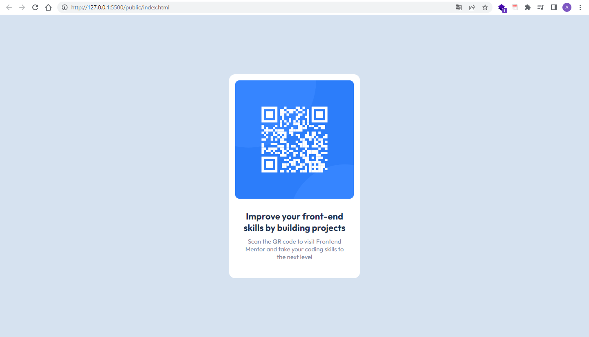

# Frontend Mentor - QR code component solution

This is a solution to the [QR code component challenge on Frontend Mentor](https://www.frontendmentor.io/challenges/qr-code-component-iux_sIO_H). Frontend Mentor challenges help me to improve my coding skills by building realistic projects.

## Table of contents

- [Overview](#overview)
  - [Screenshot](#screenshot)
  - [Links](#links)
- [My process](#my-process)
  - [Built with](#built-with)
- [Author](#author)
- [Acknowledgments](#acknowledgments)

## Overview

### Screenshot

### Links

- Website: [Frontend Mentor QR-code](https://your-solution-url.com)
- Solution URL: [Github](https://github.com/adrian12352/qr-code-component-main)

## My process

### Built with

- Semantic HTML5 markup
- CSS custom properties
- BEM Methodology

## Author

- Frontend Mentor - [Ivan](https://www.frontendmentor.io/profile/adrian12352)
- Twitter - [ivan.dev](https://twitter.com/GraciasJs_)

## Acknowledgments

s
-Learned how to use BEM Methodology throught this website:

- [Learn BEM](https://en.bem.info/methodology/quick-start/)

**Note: Practice how to resize images and margin between elements**
